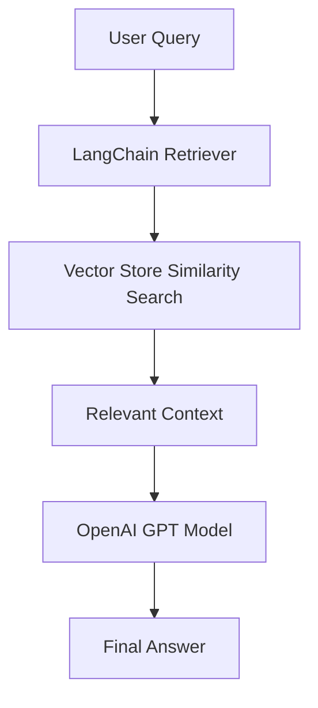

# 🧠 NotebookLM Clone — RAG-powered AI Notes Assistant

A **Retrieval-Augmented Generation (RAG)** powered note-taking and knowledge assistant inspired by **Google’s NotebookLM**.  
Built with **Next.js**, **LangChain**, **Docker**, **OpenAI**, and **Clerk** — this app allows users to upload documents, query their own data, and get context-aware AI answers.

---

## 🚀 Features

- 📄 **Document Uploads** — Upload PDFs, text, or CSV files for context-based learning
- 🧩 **RAG Pipeline** — Uses LangChain for document chunking, embeddings, and retrieval
- 🤖 **Chat with Your Notes** — Contextual chat with OpenAI’s GPT models
- 🔐 **Authentication with Clerk** — Secure user management and session handling
- ⚡ **Next.js App Router** — Modern, fast, and scalable React-based framework
- 🧠 **Vector Store Integration** — Store embeddings in Qdrant 
- 💾 **Persistent Conversations** — Save chat history and revisit your notes anytime
- 🎨 **Modern UI** — Built with Tailwind CSS & Shadcn UI for a clean notebook feel

---

## 🏗️ Tech Stack

| Category     | Technology                                                                                                                                    |
| ------------ | --------------------------------------------------------------------------------------------------------------------------------------------- |
| Frontend     | [Next.js 14](https://nextjs.org/), [React](https://react.dev/), [Tailwind CSS](https://tailwindcss.com/), [Shadcn UI](https://ui.shadcn.com/) |
| Backend      | [LangChain](https://www.langchain.com/), [Next.js API Routes](https://nextjs.org/docs/pages/building-your-application/routing/api-routes)     |
| AI / LLM     | [OpenAI API](https://platform.openai.com/docs)                                                                                                |
| Auth         | [Clerk](https://clerk.com/)                                                                                                                   |
| Vector DB    | [QdrantDB](https://qdrant.tech/)                                                                                                              |
| File Parsing | [PDF-Parse](https://www.npmjs.com/package/pdf-parse), [PapaParse](https://www.papaparse.com/)                                                 |

---

## 🧩 Project Structure

```
notebooklm-clone/
│
├── app/ # Next.js app router
│ ├── layout.tsx
│ ├── page.tsx
│ └── api/
│ ├── chat/route.ts # Chat endpoint for AI responses
│ └── upload/route.ts # File upload & embedding processing
│
├── components/ # Reusable UI components
├── lib/
│ ├── langchain/ # LangChain pipelines and retrievers
│ ├── embeddings.ts # OpenAI embeddings setup
│ └── qdrant.ts # Vector DB integration
│
├── public/ # Static assets
├── styles/ # Tailwind & global styles
├── .env.local # Environment variables
└── README.md
```

---

## ⚙️ Environment Variables

Create a `.sample.env` file in the project root:

``` bash
NEXT_PUBLIC_CLERK_PUBLISHABLE_KEY=your_clerk_key
CLERK_SECRET_KEY=your_clerk_secret

OPENAI_API_KEY=your_openai_api_key

QDRANT_URL=https://your-qdrant-instance
QDRANT_API_KEY=your_qdrant_api_key

## 🛠️ Installation & Setup
# 1️⃣ Clone the repository
git clone https://github.com/yourusername/notebooklm-clone.git
cd notebooklm-clone

# 2️⃣ Install dependencies
npm install

# 3️⃣ Setup environment variables
cp  .sample.env

# 4️⃣ Run the development server
npm run dev

Visit your app at 👉 http://localhost:3000
```

## 🧠 RAG Pipeline Overview

```
1️⃣ Document Upload: User uploads a file (PDF, text, etc.)

2️⃣ Text Extraction: The file content is parsed and split into chunks

3️⃣ Embeddings Creation: Each chunk is converted into vector embeddings using OpenAI

4️⃣ Vector Storage: Embeddings are stored in a vector database (Qdrant)

6️⃣ Query: When user asks a question, relevant chunks are retrieved using similarity search

7️⃣ LLM Response: OpenAI generates a context-aware answer based on retrieved context
```

# 🧪 Example Query Flow



## 🪪 License

This project is licensed under the MIT License.

## ⭐ Acknowledgements

LangChain

Next.js

Clerk

OpenAI

Qdrant

Docker

Google NotebookLM
— inspiration for this project.

## 💡 Future Enhancements

Add multi-document retrieval

Support for image/document summarization

Semantic search with hybrid retrieval

Collaborative workspaces

## 🧑‍🎓 Author

## Dipanjan Roy

🚀 Passionate about AI, backend development, and building meaningful projects.

### [LinkedIn](https://www.linkedin.com/in/roydipanjan2003/)

### [GitHub](https://github.com/RoyDipanjanReek)

### [Portfolio](https://nextjs.org/)

---
